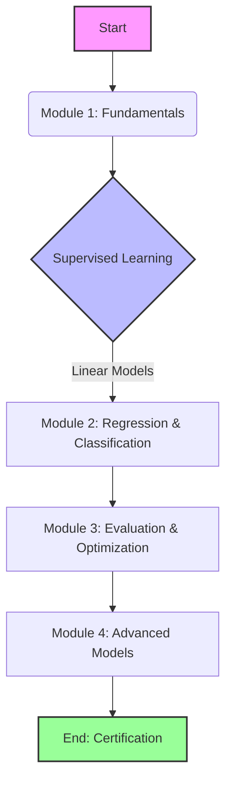

# 🎓 Applied Machine Learning in Python


## 📄 Introduction

Welcome to the repository for the **Applied Machine Learning in Python** course by the **University of Michigan** on Coursera. This repository contains detailed solutions to all assignments, quizzes, and additional learning resources/notebooks used throughout the specialization.

The course introduces the toolkit handling data in Python, focusing on:

- Supervised Learning (Linear Models, SVMs, Decision Trees)
- Unsupervised Learning (Clustering, PCA)
- Model Evaluation & Tuning
- Feature Engineering

---

## 🗺️ Course Flow & Architecture



---

## 📂 Repository Structure

The `tree` structure of the repository is organized as follows:

```text
📦 Applied-Machine-Learning-
 ┣ 📂 Assignment-1
 ┃ ┣ 📜 Assignment-1.pdf
 ┃ ┗ 📓 assignment1.ipynb
 ┣ 📂 Assignment-2
 ┃ ┣ 📜 Assignment-2.pdf
 ┃ ┗ 📓 assignment2.ipynb
 ┣ 📂 Assignment-3
 ┃ ┣ 📜 Assignment-3.pdf
 ┃ ┗ 📓 assignment3.ipynb
 ┣ 📂 Assignment-4
 ┃ ┣ 📜 Assignment-4.pdf
 ┃ ┗ 📓 assignment4.ipynb
 ┣ 📂 Resources
 ┃ ┣ 📓 Module 1.ipynb
 ┃ ┣ 📓 Module 2.ipynb
 ┃ ┗ ... (Helper Scripts & Data)
 ┣ 📜 Quiz-1.pdf
 ┣ 📜 Quiz-2.pdf
 ┣ 📜 Quiz-3.pdf
 ┗ 📜 Quiz-4.pdf
```

---

## 💻 Assignments

| Module       | Topic                               |                  Notebook Solution                  |              Problem Statement              |
| :----------- | :---------------------------------- | :-------------------------------------------------: | :-----------------------------------------: |
| **Module 1** | K-Nearest Neighbors & Python Basics | [Launch Notebook](./Assignment-1/assignment1.ipynb) | [View PDF](./Assignment-1/Assignment-1.pdf) |
| **Module 2** | Supervised Learning (Linear, SVM)   | [Launch Notebook](./Assignment-2/assignment2.ipynb) | [View PDF](./Assignment-2/Assignment-2.pdf) |
| **Module 3** | Evaluation Metrics & Decision Trees | [Launch Notebook](./Assignment-3/assignment3.ipynb) | [View PDF](./Assignment-3/Assignment-3.pdf) |
| **Module 4** | Gradient Boosting & Neural Networks | [Launch Notebook](./Assignment-4/assignment4.ipynb) | [View PDF](./Assignment-4/Assignment-4.pdf) |

---

## 📝 Quizzes

| Quiz Number | Topic Covered                  |         Document         |
| :---------- | :----------------------------- | :----------------------: |
| **Quiz 1**  | Principles of Machine Learning | [View PDF](./Quiz-1.pdf) |
| **Quiz 2**  | Supervised Learning Concepts   | [View PDF](./Quiz-2.pdf) |
| **Quiz 3**  | Model Evaluation               | [View PDF](./Quiz-3.pdf) |
| **Quiz 4**  | Advanced Supervised Learning   | [View PDF](./Quiz-4.pdf) |

---

## 📚 Course Resources & Lecture Notes

| Resource File                                                              | Description                  |
| :------------------------------------------------------------------------- | :--------------------------- |
| [Module 1.ipynb](./Resources/Module%201.ipynb)                             | Introduction to ML & K-NN    |
| [Module 2.ipynb](./Resources/Module%202.ipynb)                             | Supervised Learning In-depth |
| [Module 3.ipynb](./Resources/Module%203.ipynb)                             | Evaluation Methods           |
| [Module 4.ipynb](./Resources/Module%204.ipynb)                             | Advanced Techniques          |
| [Machine_Learning_Models.ipynb](./Resources/Machine_Learning_Models.ipynb) | Consolidated Models Overview |
| [Unsupervised Learning.ipynb](./Resources/Unsupervised%20Learning.ipynb)   | PCA & Clustering Examples    |

> **Note**: `adspy_shared_utilities.py` in the Resources folder is a helper script provided by the course instructors for plotting and visualization.

---

## 🚀 Getting Started

To run these notebooks locally:

1.  **Clone the repository**:
    ```bash
    git clone https://github.com/Startlight56/Applied-Machine-Learning-.git
    ```
2.  **Install dependencies**:
    ```bash
    pip install numpy pandas scikit-learn matplotlib seaborn jupyter
    ```
3.  **Launch Jupyter Notebook**:
    ```bash
    jupyter notebook
    ```

---

## 👤 Author

**Mausam Kar**

- **Course**: Applied Machine Learning in Python
- **Institution**: University of Michigan (Coursera)

---

_Disclaimer: This repository is for educational purposes. Please verify the honor code of your institution before referring to the solutions._
